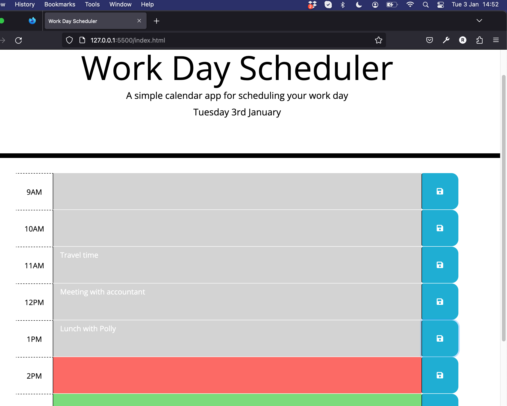

# Planner-App
Calendar application that allows a user to save events for each hour of the day

## Description

**Front-End Web Development Bootcamp - Module 7 Challenge**

This 'Work Day Scheduler' allows a user to store entries against hourly slots in a 9-5 work day.  It uses moment.js for date/time information, including dynamic highlighting.  Local storage is used to ensure the data is persistent. 

## Installation

No need to install, simply visit:  **https://rgbrain.github.io/Planner-App/**

## Usage

Having visited https://rgbrain.github.io/Planner-App/, you will presented with today's date.  You may then add notes within the grey text areas.  Clicking the blue save button on the right will save the adjascent note to local storage, meaning that even if you leave the page and return (using same browser) then the notes will be present.

**SCREENSHOT**

   

## Credits

University of Birmingham - Front-End Web-Dev Bootcamp

## License

MIT License

Copyright (c) [2022] [Richard Brain]

Permission is hereby granted, free of charge, to any person obtaining a copy
of this software and associated documentation files (the "Software"), to deal
in the Software without restriction, including without limitation the rights
to use, copy, modify, merge, publish, distribute, sublicense, and/or sell
copies of the Software, and to permit persons to whom the Software is
furnished to do so, subject to the following conditions:

The above copyright notice and this permission notice shall be included in all
copies or substantial portions of the Software.

THE SOFTWARE IS PROVIDED "AS IS", WITHOUT WARRANTY OF ANY KIND, EXPRESS OR
IMPLIED, INCLUDING BUT NOT LIMITED TO THE WARRANTIES OF MERCHANTABILITY,
FITNESS FOR A PARTICULAR PURPOSE AND NONINFRINGEMENT. IN NO EVENT SHALL THE
AUTHORS OR COPYRIGHT HOLDERS BE LIABLE FOR ANY CLAIM, DAMAGES OR OTHER
LIABILITY, WHETHER IN AN ACTION OF CONTRACT, TORT OR OTHERWISE, ARISING FROM,
OUT OF OR IN CONNECTION WITH THE SOFTWARE OR THE USE OR OTHER DEALINGS IN THE
SOFTWARE.

---

